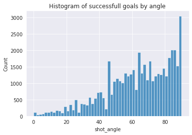
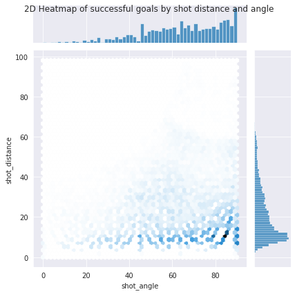
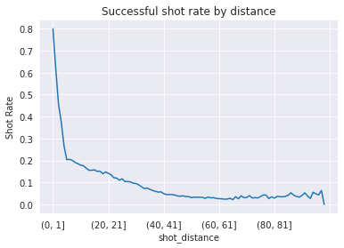
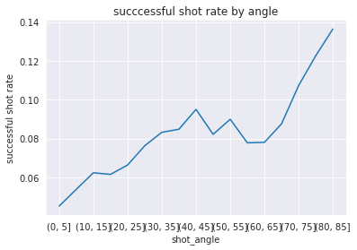
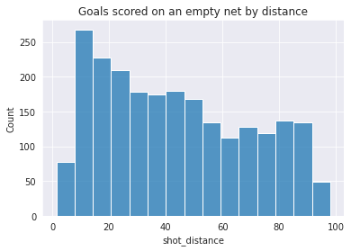
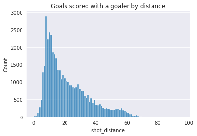

## Nombre de tirs vs. distance 

| Tir Réussits                                                         | Tirs Manqués                                                           |
|----------------------------------------------------------------------|------------------------------------------------------------------------|
|  |  |

On remarque facilement que les tirs réussits sont majoritairement proches, soit dans la zone des 10-20 mètres. Plus la distance augmente, plus les tirs réussis sont rares. Pour ce qui est des tirs manqués, la distribution semble assez uniforme. Par contre on a un pic proche du but puisque nous savons que plusieurs buts sont marqués de près, donc il vaut la pein d'en essayer plus. finalement, la ligne du _offside_ fait en sorte que peu de buts sont tentés au-delà de 70m.

## Nombre de tirs vs. angle

| Tir Réussits                                                          | Tirs Manqués                                                            |
|-----------------------------------------------------------------------|-------------------------------------------------------------------------|
|  |  |

Nous avons choisis de traiter l'angle comme un angle par rapport à la droite qui passe d'un bout à l'autre du but. Quelqu'un en face dut but a donc un angle de 90 degrés. Il est donc normal de trouver peu de buts avec un angle de 0 selon notre intuition. Il est intéressant de voir que les distributions de but réussits et manqués sont presques identiques hormis un pic de tirs manqués vers les 60 degrés. On peut aussi voir que l'anfgle avec le plut haut taux de succès est d'être directement en face du gardien.

## Histogramme 2D entre la distance et l'angle

<h1 align="center">

</h1>

Il est intéressant de constater que la majorité des tirs sont effectués à une distance de 20m du gardien et devant celui-ci. On remarque aussi que plus la distance au but est petite, plus l'angle se doit d'être en face du gardien, sinon on risque de frapper un poteau car le gardien peut bloquer l'entièretée du but.

## Taux de but à la distance/angle

| Angle                                                          | Distance                                                    |
|----------------------------------------------------------------|-------------------------------------------------------------|
|  |  |

On peut voir que le taux de succès est beaucoup plus grand lorsque l'on s'approche du but. On apercoit aussi une anomalie dans les données du a un _outlier_ qui fait en sorte qu'on obtiens 80% de succès à moins d'un mètre du but.

Pour ce qui est de l'angle, on voit une tendance qui indique que plus l'angle est proche d'être en face du gardien, plus le taux de succès est grand. C'est logique puisque quand on tir de coté, le gardien recouvre la majoritée du but. 

# But par distance par rapport de fillet vide ou non vide 

| But Vides                                    | Buts Avec Gardien                                    |
|----------------------------------------------|------------------------------------------------------|
|  |  |

La distribution des buts vides est presque uniforme quoiqu'un peu plus difficle lorsque l'on tire de loin. Les buts avec gardiens quant à eux sont beaucoup plus faciles à réaliser de près.

Notre prétraitement enlève les anomalies dans les données (tirs de la mauvaise zone). Nous ne trouvons donc aucune anomalie dans notre graphe dû à notre connaissance du domaine injectée dans notre pré-traitement.