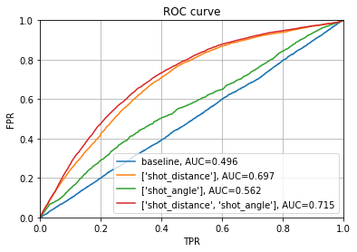
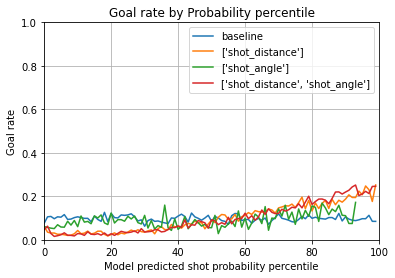

## Régression Logistique Simple

On remarque que notre classificateur obtiens une bonne performance, soit .90 d'accuracy. Pourtant, lorsqu'on observe les résultats, On remaruqe que 100% des prédictions sont de la classe 0 dû à un d.balancement dans le jeu de donnée d'entraînement.

|||
|---|---|
|||
|||

De ces graphes, on peut déduire que la distance au but est nécessaire afin d'obtenir de bonnes performances. Le modèle qui contiens uniquement l'angle se différencie à peine du _baseline_ aléatoire.
On peut aussi voir qu'utilise l'angle et la distance est un peu supérieur à la distance seule.
Pour faire ces conclusions, nous nous basons surtout sur la courbe ROC ainsi que la métrique AUC qui sera utilisée pour nos évaluations de modèles.

La courbe de calibration montre que nos modèles ne prédisent la classe 0 avec une probabilitée très faible.

Les courbes de goal rate montrent que nos modèles avec la distance battent des performances aléatoires.

Voici les liens vers nos expériences Comet.ml:
- [Distance](https://www.comet.com/williamglazer/hockeyanalysis/1ba10a235fc54b1cb7c3442ffd1fa732?experiment-tab=params)
- [Angle](https://www.comet.com/williamglazer/hockeyanalysis/53f79ca0ebac43bb919be4a484e943f2?experiment-tab=params)
- [Distance & Angle](https://www.comet.com/williamglazer/hockeyanalysis/1fa1831453114073a58a32c623ed8fc4?experiment-tab=params)