## XGBoost sur Angle & Distance

[Comet.ml](https://www.comet.com/williamglazer/hockeyanalysis/00655e4eece64684bc945bbc447ebc72?experiment-tab=chart&showOutliers=true&smoothing=0&transformY=smoothing&xAxis=wall)

| XGBoost                                   |                                              |
|-------------------------------------------|----------------------------------------------|
| 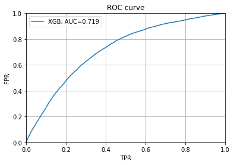          | 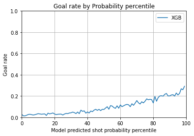          |
| 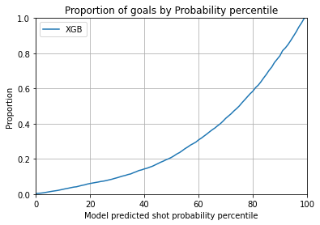 | 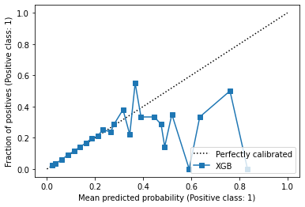 |

| Logistic Reg                                      |                                                 |
|---------------------------------------------------|-------------------------------------------------|
| 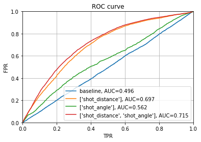               | 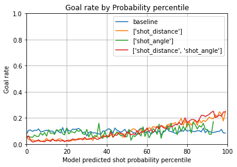     |
| 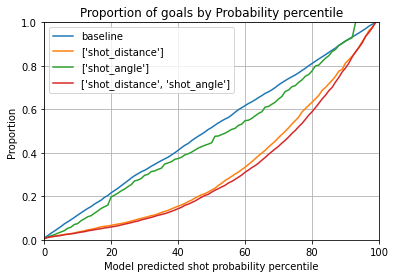 | 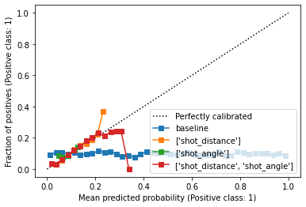 |

On peut voir qu'XGBoost obtiens des performances similaire en terme d'AUC. Par contre, nous pouvons facilement voir que les graphiques de calibration montrent qu'XGBoost tends à preédire différentes probabilitées tandisque la régression logistique prédit beaucoup plus souvent des probabilitées faibles. Nous pouvons donc déterminer que le modèle XGBoost est meilleur puisque nous voulons modéliser la probabilitée d'un tir.

## Optimisation d'Hyper-paramètres XGBooost 

[Comet.ml](https://www.comet.com/williamglazer/hockeyanalysis/1c85a5219e674091b97fcf33ceec5b3d?experiment-tab=chart&showOutliers=true&smoothing=0&transformY=smoothing&xAxis=step)

| XGBoost Best Model                             |                                                   |
|------------------------------------------------|---------------------------------------------------|
| 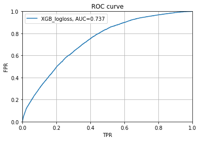          | 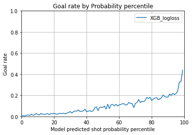          |
| 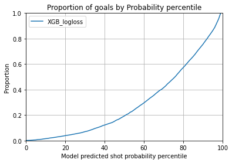 | 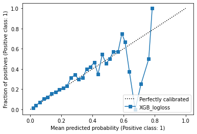 |

On peut voir que notre modèle est beaucoup plus performant sur la courbe de calibration et parvient à bien prédire la probabilitée de plusieurs événements. Il est tout de même faible autour de .7 de probabilitée. Les autres métriques sont assez similaires.

Pour nos expériences, nous procédons à un gridsearch naif sur les paramètres les plus populaires. Notre meilleur modèle est enregistré dans Comet. Nous utilisons `sklearn.Pipeline` et `sklearn.GridSearchCV` afin d'entrainer et d'évaluer nos modèles.
Ceci nous permet de faire une validation croisée et d'approximer efficacement nos performances.

Voici notre grille d'hyper-paramètres:

| Parameter     | Values             |
|---------------|--------------------|
| learning rate | [0.2, 0.01, 0.001] |
| depth         | [3, 6, 10]         |
| n estimators  | [50, 75, 100]      |

Notre meilleure modèle s'avère être:

```
{
    'xgb_model__eval_metric': 'logloss',
    'xgb_model__learning_rate': 0.2,
    'xgb_model__max_depth': 3,
    'xgb_model__min_child_weight': 1,
    'xgb_model__n_estimators': 100,
    'xgb_model__objective': 'binary:logistic'
}
```

avec un ROC-AUC de **.737**

Nous pourrions améliorer nos résultats en utilisant des méthodes de recherche telle que vues en classe comme les recherche bayésiennes ou aléatoires.

## Sélection de Caractéristiques

[Comet.ml](https://www.comet.com/williamglazer/hockeyanalysis/857cdd44f44e4f0b8ab33f4f1014683e?experiment-tab=params)

Nous utilisons une technbique de filtrage qui utilise notre algorithme XGBoost. Nous entrainons nootre modèle sur toutes les caractéristiques et nous enlevons celle ayant le moins hait score d'importance.

Le score d'importance de caractéristique est une mesure relative du nombre de fois qu'une caractéristique est utlisée afin de faire un split dans un arbre. Ce n'est pas la métrique la plus élégante, mais c'est assez pour nous suffire.

Ainsi notre processus est de :
1. Entrainer le modèle sur les caractéristiques
2. Évaluer la performance ROC-AUC
3. Identifier la caractéristique avec la plus faible importance
4. Re-faire l'étape 1 sans la caractéristique la moins importante
5. Arrêter si notre ROC-AUC baisse de plus de 1%

De toutes les caractéristiques que nous avions, nous éléminons rebound et gardons celles en gras:
- **shot_distance**
- **shot_angle**
- **dist_prev_event**
- **time_lapsed_prev_event_in_seconds**
- **game_secs**
- rebound

Voici le graphique d'importance des caractéristique:
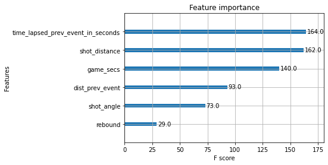

| XGBoost Less Features                          |                                                   |
|------------------------------------------------|---------------------------------------------------|
| 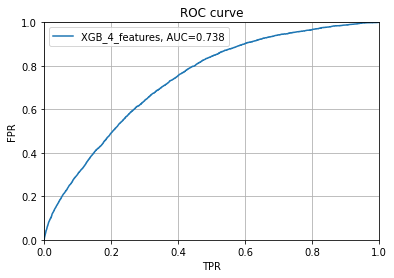          | 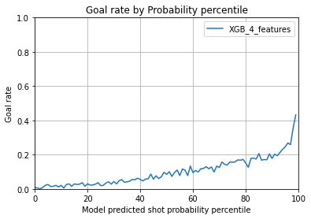          |
| 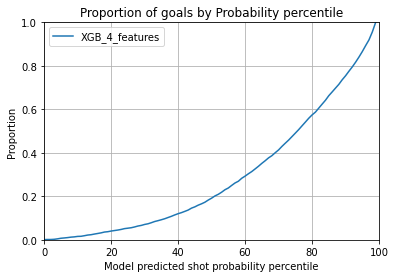 | 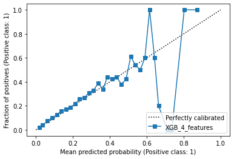 |
