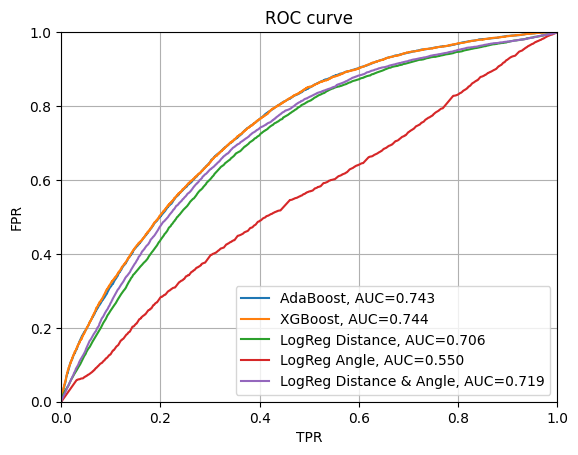
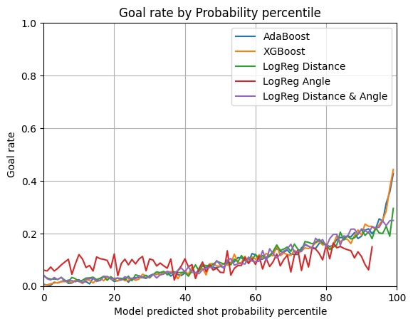
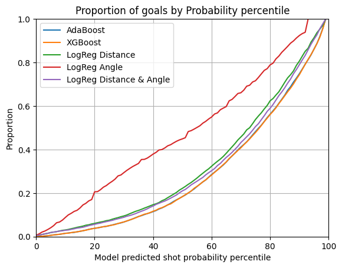
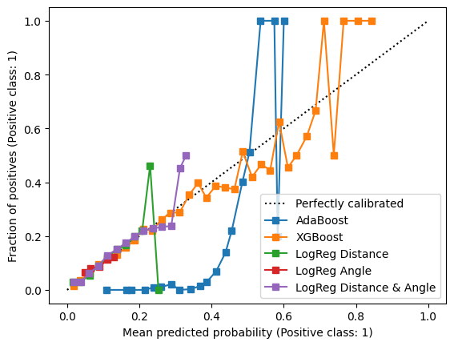
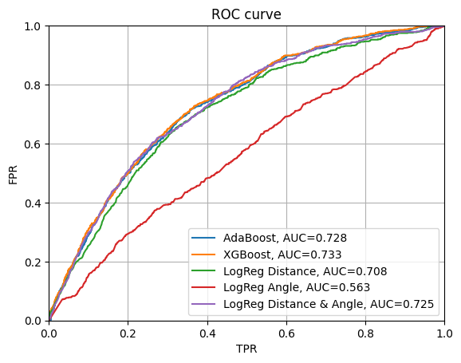
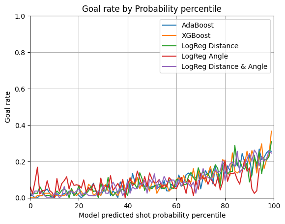
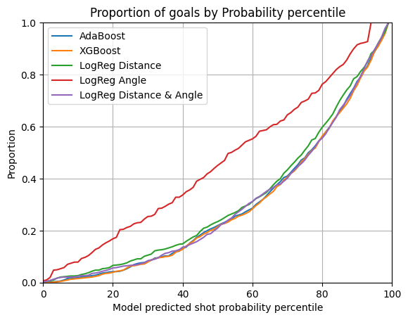
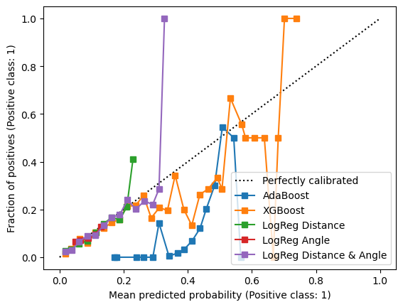

## Évaluer sur l'ensemble test

### Modèles testés sur la saison régulière

| Saison Reguliere 2019-2020                    |                                                   |
|------------------------------------------------|---------------------------------------------------|
|          |           |
|  |  |

Par rapport aux résultats obtenus par l'évaluation test on voir des différences variée selon les différents modèle. Surprenamment on voit une croissance légère pour Adaboost et XGBoost de AUC et plus logiquement une decroissance, faible, de AUC pour les modèle de Logistic Regression. XGBoost et Adaboost on une AUC similaire avec XGBoost ayant rattraper le déficite et XGBoost a une plus fort certitude et variation de probabilité. Ces deux modèles performent de façon similaire sur ces données test que sur les données de validation et entre eux, avec un petit avantage du XGBoost. Les modèles de regression logistic géneralisent aussi plutôt bien.

### Saison des playoffs 2019-2020

| Test sur les playoffs 2019-2020                        |                                                 |
|---------------------------------------------------|-------------------------------------------------|
|                |      |
|  |  |

Par rapport aux données obtenus sur la saison régulière on observe une décroissance net de l'AUC pour les modèles plus complexes et une augmentation pour les regression logistiques. De plus, à l'exception du modèle utilisant seulement les angles de tir (qui avait été précédemment remarqué comme étant moins performant) ils suivent tous les 4 une courbe similaire pour le taux de tirs prédits. Finalement, la régression logistique considérant les angles et la distance se distingue comme étant plus fiable que pour d'autres données. On voit donc que les modèles d'Adaboost et XGBoost perfoment un peu moins bien que sur les données des saisons régulières mais généralisent, mais que la regression logistique considérant la distance et l'angle est surprenamment performant dans le cas d'une réel généralisation.
